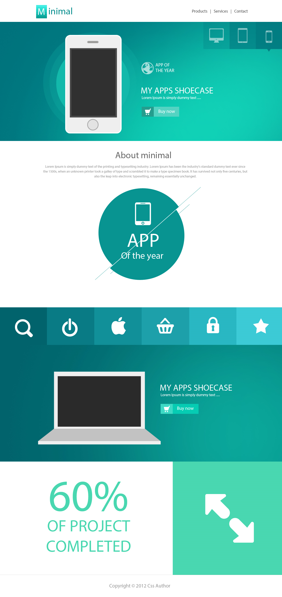

# Minimal

Project source - Git repository:

[fullirondesign/minimal-1](https://github.com/fullirondesign/minimal-1.git)

    git clone https://github.com/fullirondesign/minimal-1.git &&
    cd minimal-1

### Start

- open terminal / command line tool (cmd.exe)
- go to projects directory → directory with package.json

    yarn && yarn start

[Project Status](https://www.notion.so/cd195b5fbd044308b05c18a4dab7b97b)

## **Used stack:**

1. Node 10 LTS - component and development management
    - npm - was used to install react.js, and manage production scripts in package.json
    - yarn - downloads node modules and manages their versions
2. React - js framework (page-transitions, slider)
    - Class Components, Hook Components
    - React Router
3. Sass - styles
    - Sass compiler to CSS
4. SVG - images, animations
    - Anime.js / by hand?
5. Netlify - hosting

### Directory structure

    - **node_modules/** ----- modules downloaded from npm.com; are not deployed; listed in package.json
    - **public/** ----- files that are build and minimized, available to the public; actual finished webapp
    - **src/** ----- working folder with working files in production build. later build to public files
    -	---- **components/** ----- reusable parts of react code, to be embedded one or more time 
    -	---- **css/** ----- styles folder, includes .scss files, and compiled .css files
    -	---- **pages/** ----- all top-level components/pages of the website. Used for organizationpurposes
    -	---- **App.js** ----- top level react component that is a react app itself. It manages everything else. Includes Router
    -	---- **index.js** ----- script file, that imports react (App.js - Virtual DOM)  into index.html (actual DOM) 
    - **.gitignore** ----- git file, that includes all files to be ignored during commit/push; (ex. "/node_modules")
    - **package.json** ----- node file - list of all dependencies and their configs and npm-commands
    - **yarn.lock** ----- yarn files with list of all dependencies versions that are used in a project at the given time.

### Commands

***You have to use yarn or npm exclusively - can only have package.lock or yarn.lock - only one;***

- **yarn / *npm install*** — downloads and installs appropriate versions of all dependencies (npm-packages/node_modules) listed in package.json and all their sub-dependencies;
- **yarn start** / ***npm start*** — compiles development build to memory, and starts development server on localhost:3000;
- **yarn build** / ***npm build*** - builds a deployment-ready app to /public folder;

### Design

